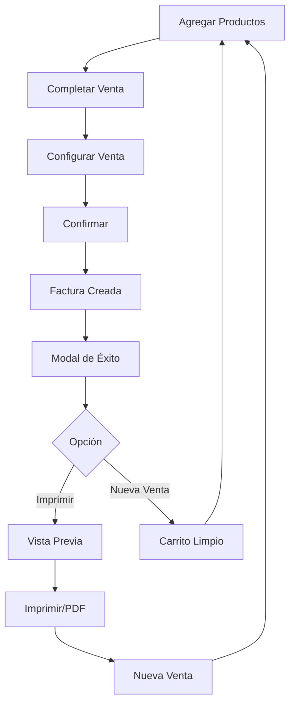

# 📄 Documentación: Impresión de Facturas

## 📚 Índice de Documentación

Esta carpeta contiene toda la documentación relacionada con la implementación de la funcionalidad de impresión de facturas en Vendix.

---

## 🚀 Inicio Rápido

**¿Primera vez aquí? Empieza aquí:**

👉 **[COMO_PROBAR_IMPRESION_AHORA.md](./COMO_PROBAR_IMPRESION_AHORA.md)**

Este documento te guiará paso a paso para probar la funcionalidad inmediatamente.

---

## 📖 Documentos Disponibles

### Para Usuarios Finales:

#### 1. 🎯 [GUIA_IMPRESION_FACTURAS.md](./GUIA_IMPRESION_FACTURAS.md)
**Propósito**: Guía completa para usuarios del sistema

**Contenido**:
- ✅ Cómo imprimir una factura paso a paso
- ✅ Consejos para una mejor impresión
- ✅ Atajos de teclado
- ✅ Solución de problemas comunes
- ✅ Preguntas frecuentes
- ✅ Mejores prácticas

**Ideal para**: 
- Usuarios finales del sistema
- Personal de ventas
- Administradores de punto de venta
- Capacitación de nuevos usuarios

---

#### 2. 🚀 [COMO_PROBAR_IMPRESION_AHORA.md](./COMO_PROBAR_IMPRESION_AHORA.md)
**Propósito**: Guía rápida de prueba

**Contenido**:
- ✅ Pre-requisitos
- ✅ Pasos rápidos para probar
- ✅ Pruebas recomendadas
- ✅ Verificación final
- ✅ Solución rápida de problemas

**Ideal para**: 
- Desarrolladores que quieren probar
- QA y testing
- Demos y presentaciones
- Validación rápida

---

### Para Desarrolladores y Técnicos:

#### 3. 🛠️ [IMPRESION_FACTURAS_IMPLEMENTADO.md](./IMPRESION_FACTURAS_IMPLEMENTADO.md)
**Propósito**: Documentación técnica completa

**Contenido**:
- ✅ Características implementadas
- ✅ Arquitectura y diseño
- ✅ Archivos modificados
- ✅ Tecnologías utilizadas
- ✅ Estructura de datos
- ✅ Endpoints del backend
- ✅ Pruebas técnicas
- ✅ Próximas mejoras sugeridas

**Ideal para**: 
- Desarrolladores del proyecto
- Arquitectos de software
- Mantenimiento y debugging
- Extensión de funcionalidades

---

#### 4. 📋 [RESUMEN_IMPRESION_FACTURAS.md](./RESUMEN_IMPRESION_FACTURAS.md)
**Propósito**: Resumen ejecutivo de la implementación

**Contenido**:
- ✅ Estado de la implementación
- ✅ Archivos creados/modificados
- ✅ Funcionalidades implementadas
- ✅ Flujo completo de uso
- ✅ Características técnicas
- ✅ Métricas de implementación
- ✅ Validación final

**Ideal para**: 
- Gerentes de proyecto
- Product owners
- Revisiones de código
- Documentación de releases

---

## 🎯 ¿Qué Documento Debo Leer?

### Eres Usuario del Sistema:
```
1. Lee: GUIA_IMPRESION_FACTURAS.md
2. Practica con: COMO_PROBAR_IMPRESION_AHORA.md
```

### Eres Desarrollador:
```
1. Lee: RESUMEN_IMPRESION_FACTURAS.md (resumen)
2. Lee: IMPRESION_FACTURAS_IMPLEMENTADO.md (detalles)
3. Prueba con: COMO_PROBAR_IMPRESION_AHORA.md
4. Referencia: GUIA_IMPRESION_FACTURAS.md (UX)
```

### Eres Manager/Product Owner:
```
1. Lee: RESUMEN_IMPRESION_FACTURAS.md
2. Opcional: GUIA_IMPRESION_FACTURAS.md (para entender UX)
```

### Eres QA/Tester:
```
1. Lee: COMO_PROBAR_IMPRESION_AHORA.md
2. Referencia: GUIA_IMPRESION_FACTURAS.md (para casos de prueba)
3. Referencia: IMPRESION_FACTURAS_IMPLEMENTADO.md (para casos edge)
```

---

## 🔧 Archivos del Código Fuente

### Frontend:

**Componente Principal:**
```
/frontend/src/components/InvoicePrint.jsx
```
Componente de React para visualización e impresión de facturas.

**Integración:**
```
/frontend/src/pages/Sales.jsx
```
Página de punto de venta con integración del flujo de impresión.

### Backend:

**Endpoint Utilizado:**
```
GET /api/v1/tenant/invoices/:id
```

**Archivos relacionados:**
```
/internal/modules/invoices/handler.go
/internal/modules/invoices/service.go
/internal/modules/invoices/repository.go
/internal/modules/invoices/models.go
```

---

## 📊 Flujo Visual



---

## ✅ Estado de la Implementación

| Funcionalidad | Estado |
|--------------|--------|
| Componente de Impresión | ✅ Completado |
| Modal de Éxito | ✅ Completado |
| Vista Previa | ✅ Completado |
| Estilos de Impresión | ✅ Completado |
| Integración en Ventas | ✅ Completado |
| Documentación de Usuario | ✅ Completado |
| Documentación Técnica | ✅ Completado |
| Pruebas Unitarias | ⏳ Pendiente |
| Envío por Email | ⏳ Pendiente |
| Impresión desde Listado | ⏳ Pendiente |

---

## 🚦 Siguiente Fase

### Prioridad Alta:
1. **Impresión desde Listado de Facturas**
   - Permitir reimprimir facturas antiguas
   - Acceso rápido desde el listado

2. **Envío por Email**
   - Generar PDF en backend
   - Enviar automáticamente al cliente

### Prioridad Media:
3. **Personalización**
   - Logo del tenant
   - Colores personalizables
   - Campos adicionales

### Prioridad Baja:
4. **Integraciones**
   - Impresoras fiscales
   - Firma digital DGII
   - XML para DGII

---

## 🆘 Soporte

### Problemas Técnicos:
1. Consulta: `IMPRESION_FACTURAS_IMPLEMENTADO.md` (sección Troubleshooting)
2. Revisa la consola del navegador (F12)
3. Verifica logs del backend

### Problemas de Usuario:
1. Consulta: `GUIA_IMPRESION_FACTURAS.md` (sección Solución de Problemas)
2. Revisa: `COMO_PROBAR_IMPRESION_AHORA.md` (sección Solución Rápida)

### Preguntas Frecuentes:
Consulta la sección de FAQ en `GUIA_IMPRESION_FACTURAS.md`

---

## 📝 Notas de Versión

### Versión 1.0.0 (19 de octubre de 2025)
- ✅ Primera implementación completa
- ✅ Componente InvoicePrint
- ✅ Modal de éxito
- ✅ Vista previa de factura
- ✅ Estilos optimizados para impresión
- ✅ Documentación completa

---

## 📞 Contacto

Para dudas o sugerencias sobre esta funcionalidad, consulta la documentación correspondiente o contacta al equipo de desarrollo.

---

## 📄 Licencia

Este código es parte del proyecto Vendix y está sujeto a la licencia del proyecto principal.

---

**Última actualización**: 19 de octubre de 2025  
**Versión de la documentación**: 1.0  
**Estado**: ✅ Completo y Actualizado

---

## 🎉 ¡Comienza Ahora!

👉 **[Haz clic aquí para empezar: COMO_PROBAR_IMPRESION_AHORA.md](./COMO_PROBAR_IMPRESION_AHORA.md)**

